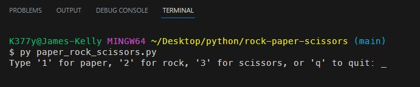
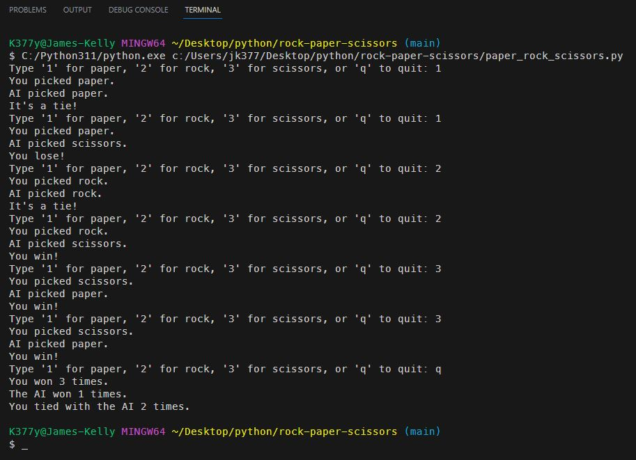

# Paper Rock Scissors
My first Python app

## *Description*
This is a simple game of Paper Rock Scissors. The user will be prompted to enter their choice of paper, rock, or scissors. The computer will then randomly select one of the three options. The user will then be notified if they won, lost, or tied. When the user decides to end the game a message will be displayed showing the number of wins, losses, and ties.
 

## *Installation*
To install this game, simply clone the repository and run the paper_rock_scissors.py file in your terminal.
 

## *Usage*

 

## *Questions*
<h3>Portfolio:&emsp;<a href="https://jk377y.dev" target="_blank">https://jk377y.dev</a></h3>
<h3>Email:&emsp;<a href="mailto:jk377y@gmail.com" target="_blank">jk377y@gmail.com</a></h3>
<h3>LinkedIn:&emsp;<a href="https://www.linkedin.com/in/james-kelly-software-developer/" target="_blank">https://www.linkedin.com/in/james-kelly-software-developer/</a></h3>
<h3>GitHub:&emsp;<a href="https://github.com/jk377y" target="_blank">https://github.com/jk377y</a></h3>
 

## *License*

 Copyright (c) 2023 James Kelly
 Information on this license can be found at: (https://opensource.org/licenses/MIT)